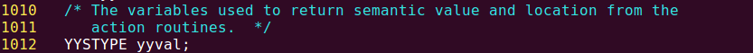

# 语法分析的过程
## Test-1
### 1.两个疑惑


这里有一个很困扰我的地方。观察`yacc.l`定义的文法，有如下代码片段：

```
statement:
	expr
	| VARIABLE '=' expr	
```

```
expr:
	INTEGER
	| VARIABLE
```

```
program:
	program statement ';'
	| statement ';'
	;
```

- 为什么yacc不把最开始的`a`规约为`expr`，而是把`a=12`一并规约为`statement`？
- 为什么yacc要等到lex匹配到`;`时，才把`a=12`规约为`statement`，而不是先将`a=12`规约为`statement`，等到`lex`匹配到`;`之后在把`statement ';'`规约为`program`？

### 2.Yacc要点
#### (1) 前瞻符号(lookahead symbol)
yacc的语法分析以`LALR(1)`文法为基础，括号中的数字表示向前展望的输入串符号的个数。不难推测，yacc进行规约时，不会每获得一个符号就尝试进行规约，它必然向前展望一个符号再做决定.`a`作为`VARIABLE`被yacc获取后，yacc向前展望到`=`，因此不会马上将`a`规约为`expr`.

yacc如何完成"向前展望"的动作？前瞻符号的语义值如何获取？

`y.tab.c`定义了存放前瞻符号及其语义值的两个变量：


**前瞻符号`yychar`：**

对`yychar`的赋值语句很多，关键是这一段代码：


`yylex()`的返回值被赋给`yychar`，yacc便取得了前瞻符号.

**前瞻符号的语义值`yylval`：**

`lex.l`


`yacc`在调用`yylex()`时，同时获得了前瞻符号及其语义值。前者来自`yylex()`的返回值，后者来自`yylex()`内对`yylval`的赋值。

#### (2) "移进－规约"过程分析

对照`yacc.l`，在`y.tab.c`中找到与之对应的语句：

`yacc.l`


`y.tab.c`


在`yacc.l`中，`$$`代表产生式左端的符号的语义值。在`y.tab.c`中，存放该值的变量是`yyval`，定义如下：



`switch`块完成`yyval`赋值后，先将被规约的、产生式右端的符号弹出，再将`yyval`压栈保存：


现在需要弄清`YYPOPSTACK`宏和`yylen`的含义：


- `YYPOPSTACK(N)`将栈顶指针`yyvsp`回退`N`的单位
- `yylen`表示产生式右端的符号数量

规约时，产生式右端的符号被从栈里弹出，规约的结果——产生式左端的符号——被压栈保存.

- - -


##### 综上，我猜测yacc对`a=12;`的规约过程大致如下：
`a`作为`VARIABLE`被yacc获取后，yacc向前展望到`=`，因此不会马上将`a`规约为`expr`.当`12`作为`INTEGER`被yacc获取后，yacc向前展望到`;`，便将`12`规约为`expr`.为什么yacc不紧接着把`VARIABLE '=' expr`规约为`statement`?原因也是一样的，它需要再向前展望一个符号，而此时尚无符号可展望，需要等待下一次调用`yylex()`后才能获得前瞻符号.随后lex匹配到`;`，yacc向前展望到文件结束符.于是yacc先将`VARIABLE '=' expr`规约为`statement`，在把`;`压栈，最后将`statement ';'`规约为`program`，结束。