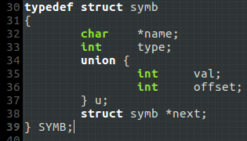
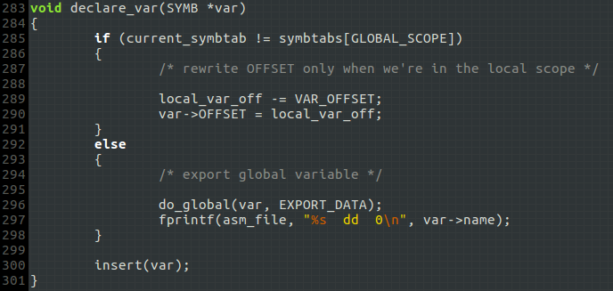
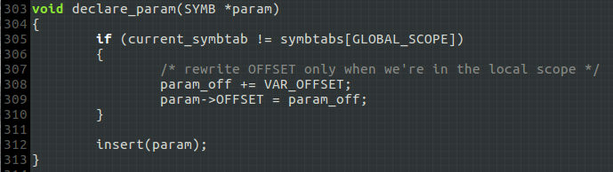
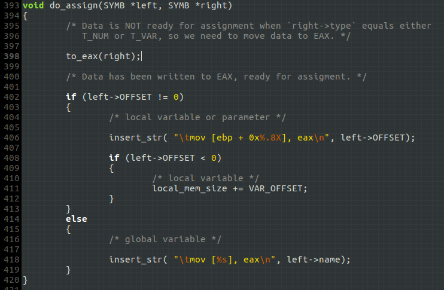
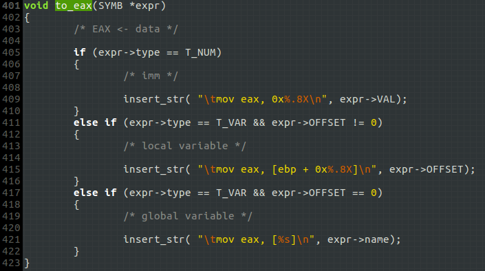
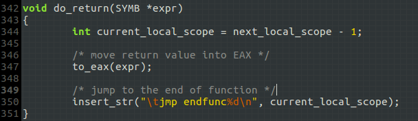
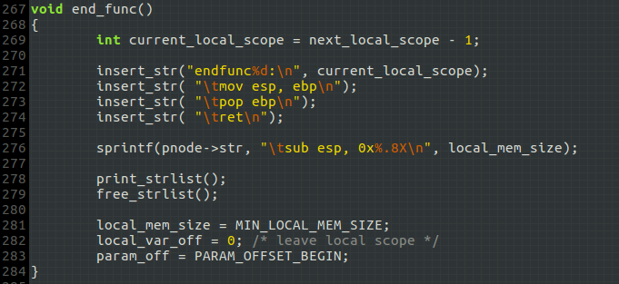

# 由三地址码生成x86汇编代码
生成的汇编代码要求符合`NASM`语法，编译生成的`ELF`格式的文件能够被gcc正确链接，因此需要在汇编代码中定义数据段和代码段，并导出全局变量和函数。

相关测试文件在[sample](./sample)目录下.

## 一、符号类别
符号包括：`变量`、`常数`和`标签`:

- **变量** 只有`变量`会被添加到符号表，而变量分为两种类型：全局/局部，二者的使用方式是不同的，对全局变量寻址时使用的是绝对地址，比如`mov [gi], 0`；对局部变量寻址时使用相对地址，比如`mov eax, [ebp + offset]`，按照C语言的约定，如果是函数内部声明的局部变量，`offset`为负；如果是函数的参数，`offset`为正。
- **常数** 三地址码中出现在表达式里的常数。
- **标签** 三地址码中用于转移寻址和函数调用的标签。

符号结构的定义:

如果是`常数`，`u.val`记录其数值；如果是`变量`，`u.offset`记录变量相对`ebp`的偏移，对于全局变量则为0. `next`用于生成函数的参数链.

**注意:** 在翻译赋值语句时，符号结构有特殊用途!

## 二、翻译过程
### (一)、全局/局部变量声明
这里的局部变量特指函数内部声明的局部变量.

- `parser.y: declare_var():`

对于局部变量，按照其声明顺序记录`OFFSET`，以便后续寻址；对于全局变量，导出之，并用伪指令`dd`将其定义为*双字*. 最后将其插入符号表.

### (二)、函数参数声明

- `parser.y: declare_param():`

函数参数与局部变量的`OFFSET`不同，因此需要分开处理.

### (三)、赋值语句
- `parser.y: do_assign():`

*左值*只能是全局变量、局部变量或函数参数，如果向局部变量赋值，则会导致函数的局部内存空间被消耗，为了能在函数结束时知道共消耗了多少局部内存空间，需要使用`local_mem_size`进行记录，这样才能更新函数开头处申请栈内存的`sub esp, xxx`指令，以此实现局部内存的动态分配.

`right`是右值，一个表达式。`to_eax()`将该表达式的值放进`eax`.

- `parser.y: to_eax():`

注意:　传给`to_eax()`的表达式的`type`只有为`T_NUM` or `T_VAR`才会被处理。如果`type`等于`T_READY`，说明数据已经被放进`eax`，不需要再生成`mov`指令了，这样的符号结构只是将该信息告知`to_eax()`，**这就是前面提到的符号结构的特殊用途！**

### (四)、表达式运算
包括：四则基本运算、布尔表达式、一元取负、函数调用、取变量值和取常数值(参见`parser.y`对`expr`的规约):

- **四则运算、布尔表达式和一元取负**：按照源操作数的类别生成不同的汇编代码，最终将结果写入`eax`，并创建一个符号结构，将`type`标记为`T_READY`，告诉`to_eax()`不用再生成`mov`指令，因为结果已经在`eax`中了.
- **函数调用**：见后文
- **取变量值**：如果变量能出现在表达式规约这一步，说明它肯定被`declare_var()`或`declare_param()`处理过了，其中内容一定有效。将它的语义值直接赋给产生式左边的`expr`，在后续使用时一定能通过`VAL`或`OFFSET`字段正确寻址.
- **取常数值**：在词法分析时，常数对应的符号节点的`VAL`字段记录了其数值，`type`字段记录了其类型为`T_NUM`参见`scanner.l:mkconst()`. 将其直接赋给`expr`，后续同样能正确使用之.

### (五)、函数调用
涉及的技术要点：参数传递、堆栈平衡操作、返回语句，以及局部内存空间的动态申请。

- **参数传递**

参数的声明语句在三地址码中是按照从左到右的顺序形成的，而C语言的调用约定中，参数压栈按照从右到左的顺序进行。因此在处理三地址码中的`arg`语句时不能每遇到一个就生成`push`，应将参数链接起来，形成一个参数链`arglist`，在生成`call`之前遍历参数链`arglist`，按照正确的顺序`push`传参.

- **堆栈平衡**

平衡堆栈的工作由调用者(caller)完成，需要根据参数个数进行。因此在形成参数链的过程中需要记录参数个数.

- **返回语句**

C语言约定：函数的返回值用`eax`传递. `do_return()`需调用`to_eax()`将表达式的值传入`eax`，再jmp到函数末尾：

处理函数末尾的函数是`end_func()`:

这里使用了`endfunc+作用域编号`来标记函数末尾.

- **局部内存空间的动态申请**

函数开头处一般有一条`sub esp, xxx`指令，负责申请局部空间，至于要申请多大的空间，需要根据局部变量的使用情况来确定。在函数内部，如果对局部变量赋值，就会消耗一个单位的内存，所以需要在`do_assign()`中作处理，参见前文. 这意味着，进入函数的局部作用域后，不能每遇到一条三地址语句就向`out.asm`中写入指令，因为函数开头处的`sub esp, xxx`只有在函数结束时才能确定。所以我设计了`STRNODE`结构体，以此构造一个链表，将函数内的汇编代码链接起来，待函数结束后修改开头处的`sub esp, xxx`，再将链表中的内容写入文件，参见上图`end_func()`.

### (六)、跳转指令
三种跳转指令的翻译很简单，不再叙述，参见`do_jz()`,`do_jnz()`,`do_jmp()`