#  生成三地址码
对`vsl`进行了修改，使其词法和语法结构适应于C语言，但所支持的只是C语言极小的一部分，比`C-`语言还简单.

## 对`VSL`的修改：
### (一)、 支持变量作用域的识别，支持全局变量和局部变量
> 该方案存在缺陷，已在(二)中说明

对于如下代码:
```
int foo()
{
	int v;
    v = 2;
    return v;
}

int bar()
{
	int v;
    v = 3;
    return v;
}
```
显然这是合法的C代码, 但使用`vsl`分析时会报错：
```
vc: variable already declared
```
原因是，`vsl`只使用了一个符号表`symbtab (main.c:line 70)`, 所有标识符，不分作用域地被添加到`symbtab`中. 

为了实现对全局变量和局部变量的支持，需要作如下修改：

**1.修改文法，支持全局变量：**

`parser.y`:

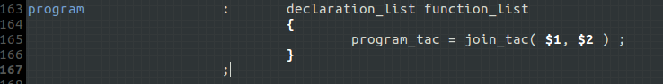

**2.定义多个符号表：**

`main.c`:

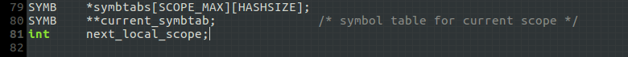

- `symbtabs[0~(SCOPE_MAX-1)]` 不同作用域对应的符号表. 规定 ：
	- `symbtabs[0]` 全局符号表, 包括全局变量和函数名；
	- `symbtabs[1~*]` 局部符号表, 包括各个函数内声明的局部变量.
- `current_symbtab` 当前作用域对应的符号表
- `next_local_scope` 切换局部作用域时使用之
- 上述变量的初始化放在`main.c:init_vc()`

**3.修改以前对`symbtab`操作的函数，改为`current_symbtab`:**
- `main.c:insert()`
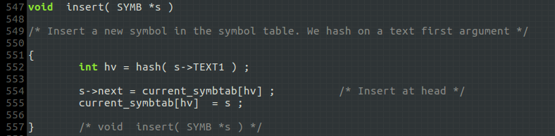

- `main.c:lookup()`
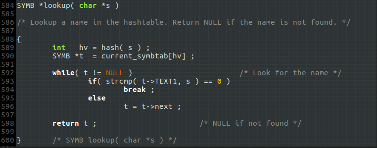

**4.作用域切换**

每次`function`规约结束的时候，切换到全局作用域；每次`function`规约开始的时候切换到该`function`的局部作用域.

为了能知道`function`何时开始规约，原先的文法显然是做不到的，因此需要修改文法：

`function`: 切换到全局作用域
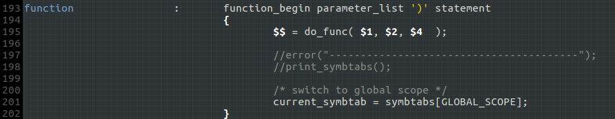

`function_begin`: 切换到局部作用域
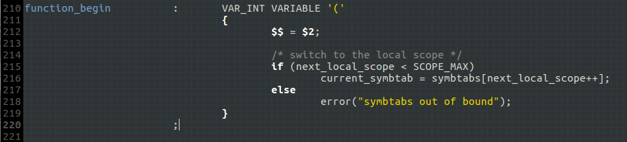

这样就有机会在`function`开始的时候执行语义子程序，完成局部作用域的切换.

**测试结果：**
使用[./sample.c/test.c](./sample.c/test.c)作为输入，将`function`语义子程序的两条语句取消注释，执行结束后可看到符号表状态：

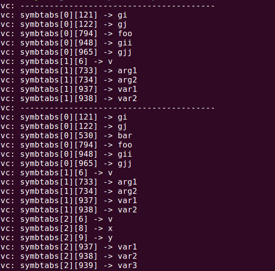

4个全局变量和2个函数名`foo` & `bar`被放到了`symbtabs[0]`，而`foo` & `bar`各自的局部变量分别处在`symbtabs[1]`和`symbtab[2]`.

生成的三地址码也是正确的: [./sample.c/test.cas](./sample.c/test.cas)

### (二)、对全局变量的赋值问题

在(一)中阐述的设计中，如果在函数内引用全局变量则会出现*变量未定义*的问题，因为检索符号只在当前作用域内进行；正确的做法是：优先在当前作用域内检索，当检索不到时再切换到全局作用域，若还检索不到才能说明该符号未定义。

**1. 修改`main.c: lookup()`, 通过参数指定需要在哪个符号表内查找:**

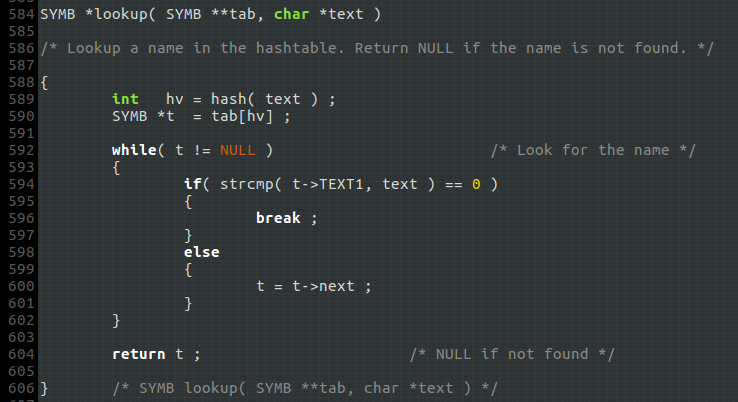

**2. 修改`parser.y`与`expression`有关的语义子程序，允许全局变量出现在表达式中：**

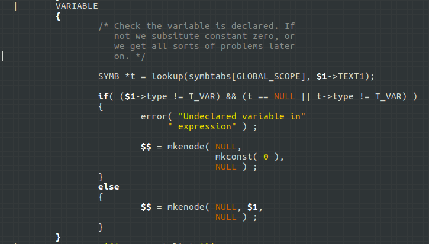

**3. 修改`parser.y: do_assign()`，允许向全局变量赋值:**

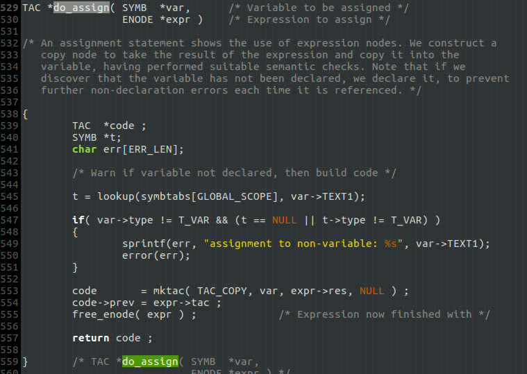

**4. 修改`main.c: ts()`, 支持全局变量识别：**

思路：
首先在局部作用域内检查符号的`type`，如果所有`case`均未命中，则查找全局符号表，若查找结果为空，报错；否则重新检查`type`.

**测试结果：**
- 测试源文件[./sample.c/test2.c](./sample.c/test2.c)
- 三地址码[./sample.c/test2.cas](./sample.c/test2.cas)

### (三)、规定：不允许局部变量与全局变量重名
要实现该规则，需要修改两个函数：

**1. `parser.y: declare_var()`**

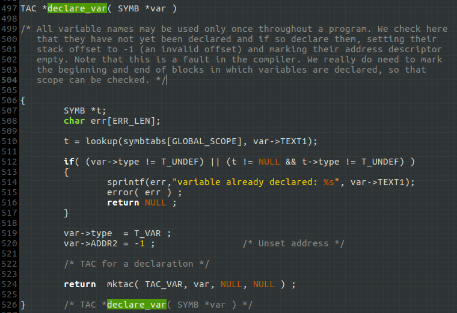

优先检索局部符号表，如果发现变量已声明，报错；若在局部符号表中检索无果，则检索全局符号表，如果发现变量已声明，亦报错.

**2. `scanner.l: mkname()`**

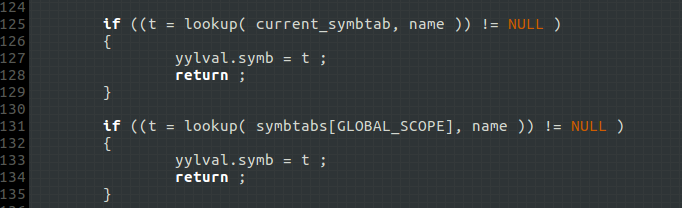

如果在当前符号表（局部 or 全局）内发现该符号，直接返回已存在的符号；否则如果在全局符号表内发现之，亦直接返回已存在的符号.

**测试结果:**
- 测试源文件[./sample.c/test3.c](./sample.c/test3.c)
- 分析结果：

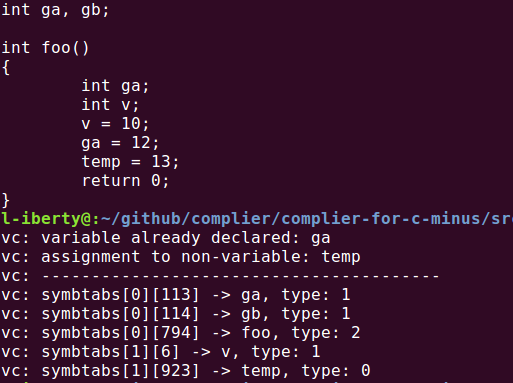

声明与全局变量同名的局部变量`ga`，报错；使用未定义符号`temp`，报错。符号`temp`的类型为`0`，表示未定义；`ga`也只出现在全局符号表中.

### (四)、函数形参的声明
生成三地址码时，如果在函数内部将形参和局部变量都声明为`int`，则无法区分二者。为此，语法分析遇到函数形参`parameter_id`时，需要给符号的*类型*字段加上形参掩码`PARAM_MASK`，以便后续识别。需要修改`parser.y: declare_var()`等函数。

在三地址码中，形参用`int_param`标识，区别于其他变量声明.

### (五)、将函数名生成到三地址码中
这是为了后面生成汇编代码时便于导出函数名。相关修改如下：

`parser.y: do_func()`

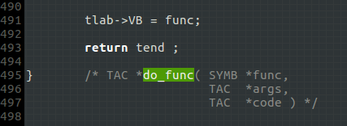

`main.c: print_instr()`

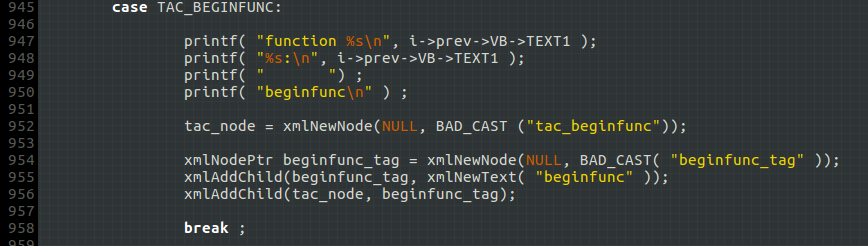

这些修改都是基于动态调试时对数据结构的观察结果。

### (六)、扩展：支持关系运算符
- 测试源文件为[./sample.c/test4.c](./sample.c/test4.c)

## 文件夹内容说明
- `code.vsl/` vsl源码. 原始的`cg.c`和`main.c`已被替换，用替换后文件编译出来的程序指向`*.vas`文件输出三地址码.
- `sample.vsl/` vsl作者提供的示例代码.
- `code.c/` 在vsl源码基础上修改, 适应于C语言. 除词法和语法外的改动如下:
	- 修改了`main.c:decode_args()`，支持源代码文件后缀名为`.c`, 生成的三地址码文件后缀名为`.cas`.
	- 修改了`main.c:print_instr()`　& `cg.c:cg()`, 将三地址码生成到xml文档.
- `sample.c/` C语言源代码.


## 使用
```
$ cd code.c
$ make
$ ./vc ../sample.c/test.c
```
键入上述命令后，将在`sample.c/`下生成`test.xml`和`test.cas`.
