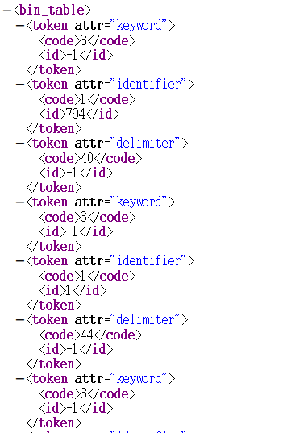
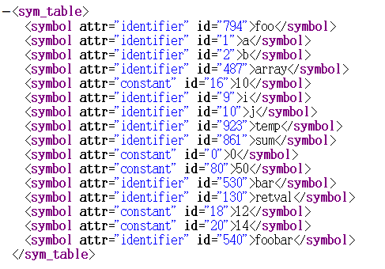

# C-Minus

## 文法修改说明
- 我修改了函数的参数列表的文法，使其与C语言一致。符合原本函数声明语法的语句为`int foo(int a, b, c; bool x, y);`，修改后为`int foo(int a, int b, int c, bool x, int y);`

## 测试

测试文件为[sample/test1.c](sample/test1.c)和[sample/test2.c](sample/test2.c)。`test1.c`语法正确，下面的xml文件都是基于它的；`test2.c`有语法错误.

### `bin.xml` 词法分析结果——二元式文档:

1. `code`是单词符号的编码，定义在[lex.h](lex.h)中;
2. `id`是单词符号在符号表中的位置，若不在符号表中，该字段为`-1`.

### `sym.xml` 词法分析结果——符号表文档（程序在内存中也维护一个符号表，使用哈希表实现）

`id`是该符号在符号表中的索引

### `syntax_tree.xml` 语法分析结果——语法树文档

