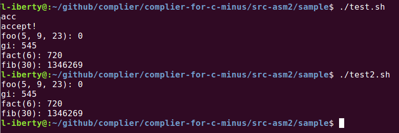

# 测试脚本
### `test.sh` 
- 使用`vc`解析源文件`test.c`，生成三地址码`test.cas`和`test.xml`；
- 使用的`asm`解析三地址码，生成汇编代码`out.asm`；
- 使用`nasm`编译`out.asm`，生成ELF格式的`out.o`；
- 使用gcc将`main.c`编译为`main.o`；
- 使用gcc将`main.o`和`out.o`链接成可执行文件`test`.

### `test2.sh` 
- 仅使用gcc编译链接，生成可执行文件`test2.`

# 测试结果
`test`和`test2`的执行结果一致，说明测试通过:

