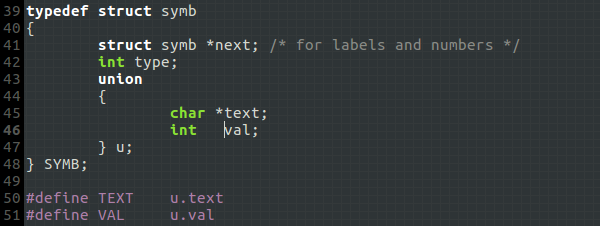
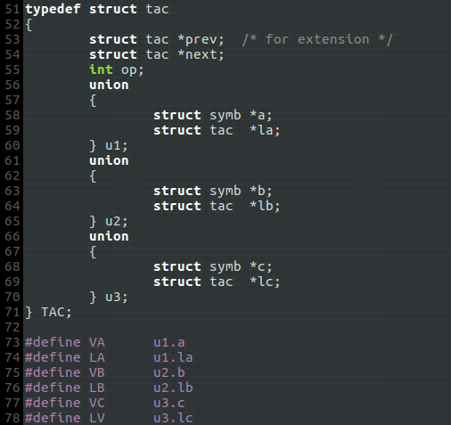
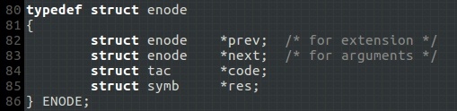
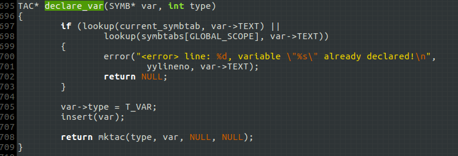

# 生成三地址码(2)

- 此版本不生成XML格式的三地址码文档，若有需要请移步[src-tac](../src-tac)
- 此版本的所有代码由我编写，部分实现参考了VSL.
- `src-tac2`不提供单独的测试文件，具体的测试请移步[src-asm2](../src-asm2)

## 一、数据结构
### 1. 符号`SYMB`

- `next` 用于构建链表`symb_list`
- `type` 符号的类型. 只有`标识符(变量名<T_VAR>和函数名<T_FUNC>)`会被添加到符号表`symbtabs`;`标签<T_LABEL>`和`数字<T_NUM>`则被添加到链表`symb_list`.
- `u.text` 对于`标识符`，保存具体的字符串.
- `u.val` 对于常数(标签)，保存其数值(标签序号).

### 2. 三地址码`TAC`

- `prev` & `next`　链接每一步生成的三地址码，形成双向链表结构，但事实上`prev`指针并没有实质性作用，这么设计仅是为了代码的扩展性.
- `op` 三地址码进行何种操作.
- `u1` & `u2` & `u3` 三地址码的三个操作数. 最初编码时我只设计了`struct symb*`类型，`struct tac*`是后续扩展进去的.

### 3. 表达式`ENODE`

- `next` 专门用于函数的参数传递，参数表实则是一个表达式链表`expr_list`.
- `res` 表达式的结果一定保存在一个变量中.
- `code` 与表达式结果`res`关联的三地址码.　例如: 表达式结果存放在`T0`，有一个`TAC`结构表示了三地址码`T0 = a + 10`, 则`code`指向该`TAC`结构.

### 4. 符号表`symbtabs`存储结构
`symbtabs`保存的符号类型为`T_VAR`和`T_FUNC`,使用`哈希表`实现，使用`开放定址发`解决哈希冲突，即: 在位置`i`发生冲突，则尝试位置`i+1`，直到找到可用位置.

## 二、翻译过程

**翻译过程和`src-tac`差别不大，以下仅阐述几个关键点.**

- 作用域切换策略和作用域检查规则与`src-tac`中描述的一致，此处不再赘述.
- VSL对标识符的处理存在一个让我不舒服的地方：不论是变量名还是函数名，都使用`VARIABLE`来表示，最初将其标记为`未定义T_UNDEF`，到后面才对二者进行区别. 显然，`VARIABLEA`在名字上容易引起歧义，`src-tac2`解决了这个问题.

### 1. 变量声明 `parser.y:declare_var()`

`src-tac`中，为了识别局部变量和函数参数，我通过给变量的`SYMB`结构的`type`字段加上`形参掩码`实现，此处不再通过`SYMB::type`区别之，而是通过`TAC::op`来区别，这是因为`print_tac()`生成三地址码时仅判断`TAC::op`字段.

### 2. 函数调用 `parser.y:do_call()`
该函数的注释写得很详细，此处不再赘述. 需要注意的是，VSL生成的函数调用语句形如`call L10`，相应地，函数入口也是用一个`L`打头的标号来标记. 我修改`VSL`时，在函数入口添加了函数名标号，但`call`语句没修改. `src-tac2`首先删除了函数入口处的`L`标号，仅保留函数名标号；并将`call`后面的标号名改为函数名，增强了三地址码的可读性.